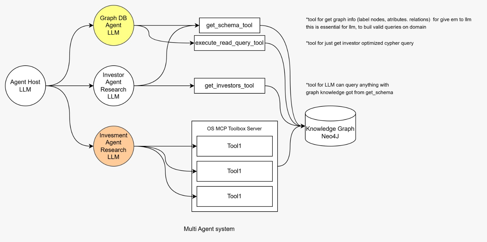

# graphrag-agentic-system
Multi-agent research system that combines the power of AI agents, Neo4j Graph Database, and the MCP Toolbox for Databases.

This project is structured using clean architecture and design patterns.
This enables the system to be easily extended and modified.

Why use ADK framework?
ADK is a framework that provides a set of tools and utilities for building AI agents and the most important is its feature router that allows to create a multi-agent system easily.

## 🏗️ Architecture

References:
- [Mcp Toolbox Databases](https://github.com/googleapis/genai-toolbox)
This MCP server acts as an “interpreter” between AI agents and databases, translating requests from AI agents into appropriate database queries and executing them.
- [MCP Toolbox Databases MongoDB](https://www.mongodb.com/company/blog/innovation/simplify-ai-driven-data-connectivity-mcp-toolbox)
- [Guide to MCP Toolbox Databases](https://www.f2t.jp/en/blog-post/mcp-toolbox)

Stack:
- Python
- ADK
- MCP Toolbox for Databases
- Neo4j
- Uv