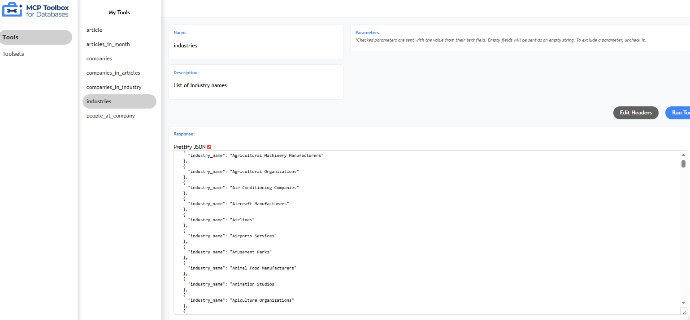

1. Installing the server
    - Option 1. Install binary, the easiest way
    - Download the `toolbox` binary from the [official repository](https://github.com/googleapis/genai-toolbox/releases).
    - Option 2. Compiling from source code for customizations
2. Configuring the yaml tools
    - Edit `mcp/tools.yaml` as needed.
3. Running the server and testing it
    - Run the following command:
      ```powershell
      .\mcp\toolbox.exe --tools-file "mcp/tools.yaml" --ui
      ```
    - Access the UI at: [http://localhost:5000/ui](http://localhost:5000/ui)
    

4. Integrate the server

References:
- [Mcp Toolbox Databases](https://github.com/googleapis/genai-toolbox)
- [Guide to MCP Toolbox Databases](https://www.f2t.jp/en/blog-post/mcp-toolbox)