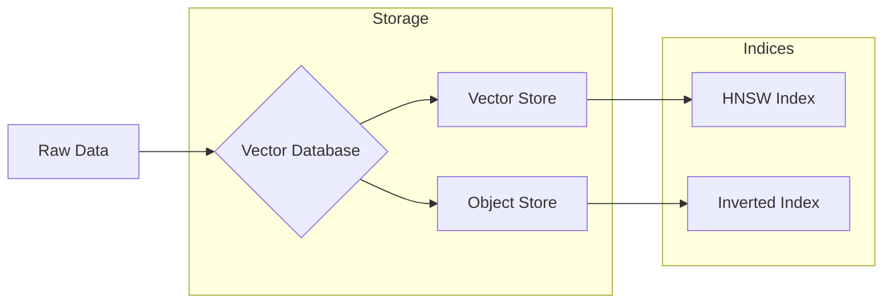

# Lecture 2: Vector Databases & Hybrid Retrieval

## 1. The Role of Vector Databases

In a production RAG environment, standard relational databases often fail to scale for semantic search. A **Vector Database** is engineered from the ground up to index and query high-dimensional data using specialized algorithms like HNSW.

- **Optimization**: Unlike traditional DBs, they are optimized for computing vector distances and building proximity graphs.
- **Origins**: Their rise coincided with the explosion of Large Language Models (LLMs) and embedding-based techniques in the early 2020s.
- **Provider Example**: **Weaviate** is a leading open-source vector database that supports both local and cloud deployments, providing exactly the functionality needed for state-of-the-art retrieval.

## 2. The Retrieval Workflow

Getting a vector database ready for a RAG application involves a series of coordinated steps:

1. **Configuration**: Defining a **Collection** (schema) and specifying which **Vectorizer** (embedding model) to use.
2. **Ingestion (Batching)**: Loading documents into the database. Modern DBs use batch methods to handle high-throughput ingestion and track potential errors.
3. **Indexing**: The database automatically generates:
   - **Dense Indices**: For semantic/vector search (e.g., HNSW).
   - **Inverted Indices**: For keyword/lexical search (BM25).

## 3. Advanced Search Paradigms

Vector databases allow you to query data using different lenses, depending on the use case.

### Vector Search (Semantic)

Retrieves objects based on conceptual similarity. The query is embedded, and the database calculates the distance (e.g., Cosine Similarity) between the query vector and document vectors.

### Keyword Search (Lexical)

Uses the **BM25** algorithm to find exact matches for technical terms, IDs, or specific entities. It relies on the Inverted Index created during ingestion.

### Hybrid Search: The Industry Standard

The most robust approach in production is **Hybrid Search**, which combines the strengths of both semantic and lexical retrieval in parallel.

- **Mechanism**: The system runs a vector search and a keyword search simultaneously, then re-ranks the results.
- **The Alpha Parameter ($\alpha$)**: Controls the weight of each search type.
  - $\alpha = 0.0$: Pure **Keyword** search.
  - $\alpha = 1.0$: Pure **Vector** search.
  - $\alpha = 0.25$: 25% Vector weighting / 75% Keyword weighting.

> [!TIP]
> **Why use Hybrid?** It balances the "loose" conceptual matching of vector search with the "strict" exact matching required for technical precision.

## 4. Metadata Filtering

To increase precision, we can apply **hard filters** on top of our search results. For example, you might want to retrieve articles about "AI" but only those published in "2024".

- **Pre-filtering**: Narrowing the search space before similarity is calculated.
- **Post-filtering**: Trimming results after the search is complete.
- **Metadata**: Attributes like category, date, or author are stored alongside the vector for this purpose.

---

**Key Takeaway**: Vector databases like Weaviate are the engine of RAG systems. By integrating semantic vectors, keyword indices, and hybrid re-ranking logic, they provide the flexibility and speed required to serve enterprise-grade AI applications.
