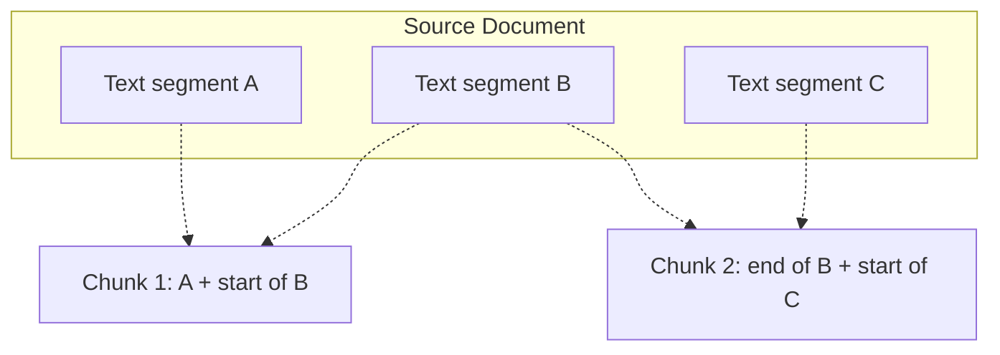

# Lecture 3: Strategic Text Chunking

## 1. What is Chunking?

**Chunking** is the process of breaking long documents from a knowledge base into smaller, manageable text segments (chunks). In a production RAG pipeline, chunking is not just a technical necessity but a critical optimization step.

### Why Chunking Matters:

- **Embedding Constraints**: Most embedding models have a maximum token limit (e.g., 512 or 8192 tokens) and cannot process an entire book or lengthy report in a single pass.
- **Search Relevancy**: Large documents compress too much information into a single vector, leading to a "fuzzy" or averaged representation. Smaller chunks allow for sharper, more precise vector matches.
- **Context Efficiency**: LLMs have limited context windows. Sending a relevant 500-word chunk is significantly more efficient than sending a 500-page book.

## 2. The Granularity Trade-off

The first decision in ANY chunking strategy is selecting the right size.

_Source: [Retrieval-Augmented Generation by Zain Hasan - DeepLearning.AI](https://www.deeplearning.ai/courses/retrieval-augmented-generation/)_

- **Too Large (e.g., Chapter Level)**: Fails to capture nuanced meaning. One vector trying to represent 50 topics will likely miss the specific one the user is asking about.
- **Too Small (e.g., Word Level)**: Loses all surrounding context. A vector for the word "bank" without context could refer to a river or a financial institution.

> [!TIP]
> **Recommended Starting Point**: For most general text, start with chunks of **~500 characters** and an overlap of **50-100 characters**.

## 3. Common Chunking Strategies

### A. Fixed-Size Chunking

_Source: [Retrieval-Augmented Generation by Zain Hasan - DeepLearning.AI](https://www.deeplearning.ai/courses/retrieval-augmented-generation/)_

The simplest method where document text is split at exact intervals (e.g., every 250 characters).

### B. Sliding Window (Overlapping)

_Source: [Retrieval-Augmented Generation by Zain Hasan - DeepLearning.AI](https://www.deeplearning.ai/courses/retrieval-augmented-generation/)_

To prevent semantic loss at the edges of fixed chunks, we introduce an **overlap**. This ensures that cohesive thoughts split by a boundary appear in multiple chunks, preserving their context.

### C. Recursive Character Splitting (Structure-Aware)

_Source: [Retrieval-Augmented Generation by Zain Hasan - DeepLearning.AI](https://www.deeplearning.ai/courses/retrieval-augmented-generation/)_

A more sophisticated approach that attempts to split on natural document boundaries like newlines (`\n`), paragraphs, or structural tags.

- **Benefit**: Increases the probability that related concepts are kept together in a single chunk.
- **Domain Specifics**:

_Source: [Retrieval-Augmented Generation by Zain Hasan - DeepLearning.AI](https://www.deeplearning.ai/courses/retrieval-augmented-generation/)_

  - **Code**: Split on function or class definitions.
  - **Web Pages**: Split on HTML headers (`<h1>`, `<h2>`) or paragraph tags.
  - **Books**: Split on page or paragraph breaks.

## 4. Metadata Inheritance

When a document is chunked, each resulting segment must retain the **Metadata** of the parent source. This allows the retriever to track the chunk's location, author, date, and source file.

- **Example**: A chunk from "Page 45" of "AnnualReg_2023.pdf" should include that context in its metadata so the LLM can cite the source accurately.

---

**Key Takeaway**: Strategic chunking transforms a "noisy" knowledge base into a high-precision retrieval engine. By balancing chunk size with structural awareness, we ensure the embedding model captures sharp semantic signatures and the LLM receives perfectly pruned context.
