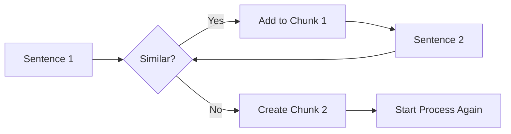

# Lecture 4: Advanced Chunking Techniques

## 1. The Context Loss Challenge

While basic chunking strategies like fixed-size or recursive character splitting are efficient, they carry a significant risk: **context fragmentation**. When a document is split arbitrarily, the resulting chunks may lose the nuanced meaning of the original text.

_Source: [Retrieval-Augmented Generation by Zain Hasan - DeepLearning.AI](https://www.deeplearning.ai/courses/retrieval-augmented-generation/)_

- **The Problem**: A sentence like _"That night she dreamed... that she was finally an Olympic champion"_ could be split in a way that makes it seem like she is already a medalist, rather than just dreaming of it.
- **The Solution**: Advanced techniques aim to intelligently build chunks based on the **semantic meaning** and logical flow of the text rather than character counts.

## 2. Semantic Chunking

Semantic chunking focuses on placing sentences together based on their conceptual similarity.

_Source: [Retrieval-Augmented Generation by Zain Hasan - DeepLearning.AI](https://www.deeplearning.ai/courses/retrieval-augmented-generation/)_

### How it Works:

1. **Sentence Vectorization**: The algorithm moves through the document one sentence at a time, converting each into a vector.
2. **Similarity Comparison**: It compares the vector of the current growing chunk with the vector of the next sentence.
3. **Thresholding**:
   - If the distance is below a specific **threshold**, the sentence is added to the chunk.
   - If the distance crosses the threshold (a "peak" in dissimilarity), a split is created, and a new chunk begins.

- **Benefit**: Creates variably sized chunks that follow the author's train of thought, even across paragraph breaks.
- **Drawback**: **Computationally expensive**, as it requires repeatedly calculating embeddings for every sentence in the knowledge base.

## 3. LLM-Based Chunking

This strategy leverages the reasoning capabilities of Large Language Models to define boundaries.

_Source: [Retrieval-Augmented Generation by Zain Hasan - DeepLearning.AI](https://www.deeplearning.ai/courses/retrieval-augmented-generation/)_

- **Mechanism**: The document is passed to an LLM with specific instructions to identify logical transitions, topic shifts, or conceptual units.
- **Performance**: Despite being a "black box" approach, it is highly effective at capturing complex thematic structures.
- **Economic Viability**: As LLM costs continue to drop, this approach is becoming increasingly practical for high-precision RAG systems.

## 4. Context-Aware Chunking (Contextual Retrieval)

A powerful improvement that can be applied to any strategy is to add specific context to every individual chunk.

_Source: [Retrieval-Augmented Generation by Zain Hasan - DeepLearning.AI](https://www.deeplearning.ai/courses/retrieval-augmented-generation/)_

- **The Strategy**: Use an LLM to generate a brief summary or "context header" for each chunk, explaining its role within the broader document.
- **Example**: A chunk listing names at the end of a blog post might be incoherent on its own. With context-aware chunking, the LLM adds text like: _"This chunk list contributors to the blog post discussed earlier regarding [Topic]." _
- **Impact**:
  - **Retrieval**: Higher search relevancy because the added context is vectorized.
  - **Generation**: Helps the LLM understand the background of a retrieved chunk when generating the final answer.

> [!TIP]
> Context-aware chunking is a "gold standard" first improvement because it increases precision without impacting search speed (since context is added during preprocessing).

## 5. Strategic Implementation & Trade-offs

Choosing the right chunking strategy requires balancing performance needs against computational costs.

| Technique           | Complexity | Cost      | Performance |
| :------------------ | :--------- | :-------- | :---------- |
| **Fixed/Recursive** | Low        | Low       | Moderate    |
| **Semantic**        | High       | High      | High        |
| **LLM-Based**       | High       | High      | Very High   |
| **Context-Aware**   | Very High  | Very High | Exceptional |

### Recommendations:

1. **Start Simple**: Use fixed-size or recursive character splitting as a baseline for prototypes.
2. **Experiment Small**: Test advanced techniques on a data subset to see if the gain in precision justifies the cost.
3. **Prioritize Context**: Context-aware chunking is often the most impactful first step beyond basic splitting.

---

**Key Takeaway**: Advanced chunking is about preserving the "soul" of the data. While semantic and LLM-based strategies are more resource-intensive, they prevent the loss of critical context, ensuring that retrieval remains accurate and generation stays grounded in reality.
