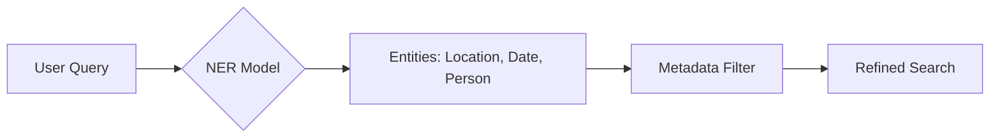

# Lecture 5: Query Parsing & Transformation

## 1. The Gap Between Conversation and Retrieval

In production RAG systems, users interact with LLMs in a conversational manner. However, human-written prompts often make for poor search queries because they contain "noise" (conversational filler) and lack specific keywords needed for database retrieval.

- **The Problem**: Prompting is "Apples to Oranges" (answering a question vs. finding a document).
- **The Solution**: **Query Parsing** allows the retriever to analyze, rewrite, or transform a prompt into an optimized search query before it ever hits the database.

## 2. Basic Query Rewriting

Query rewriting is the most common and effective technique. It uses an LLM to "clean up" the user's input.

### Example: Medical RAG

- **User Prompt**: _"I was out walking my dog Poppy when she yanked on her leash. Three days later my shoulder is numb and my fingers are all pins and needles. What's going on?"_
- **LLM Rewrite**: _"Experienced sudden forceful pull on shoulder; persistent shoulder and finger numbness (nerves/pins and needles) for 3 days. Potential causes: neuropathy or nerve impingement."_

**Benefits**:

- Clarifies ambiguous phrases.
- Uses domain-specific terminology (e.g., "nerve impingement" instead of "yanked").
- Removes irrelevant details (e.g., "black lab named Poppy").
- Increases the probability of a vector match.

## 3. Named Entity Recognition (NER)

NER identifies specific categories of information within a query—such as people, locations, dates, or technical terms.

_Source: [Retrieval-Augmented Generation by Zain Hasan - DeepLearning.AI](https://www.deeplearning.ai/courses/retrieval-augmented-generation/)_

- **Tools**: Models like **GLiNER** can be used as lightweight, efficient recognizers.
- **Application**:
  - **Vector Search**: Boost specific entities in the search query.
  - **Metadata Filtering**: Automatically apply "hard filters" (e.g., if the user mentions "2024", apply a date filter to the search).

## 4. Hypothetical Document Embeddings (HyDE)

**HyDE** (often referred to as HIDE in some contexts) transforms the search process by generating a "fake" ideal answer first.

_Source: [Retrieval-Augmented Generation by Zain Hasan - DeepLearning.AI](https://www.deeplearning.ai/courses/retrieval-augmented-generation/)_

### The Workflow:

1. **Generation**: The LLM creates a _hypothetical_ document that would ideally answer the user's question.
2. **Embedding**: This hypothetical document (not the original query) is vectorized.
3. **Retrieval**: The vector search compares the hypothetical document against the real documents in the knowledge base.

- **Advantage**: It shifts the comparison from "Query vs. Document" (Apples to Oranges) to **"Document vs. Document"** (Apples to Apples), significantly improving semantic alignment.
- **Trade-off**: Adds latency due to the additional LLM generation step.

## 5. Strategic Implementation

| Technique           | Complexity | Latency | Recommended Use                                                 |
| :------------------ | :--------- | :------ | :-------------------------------------------------------------- |
| **Basic Rewriting** | Low        | Low     | **Default approach**; provides the best ROI.                    |
| **NER**             | Moderate   | Low     | Use when metadata filtering is critical.                        |
| **HyDE**            | High       | High    | Use for complex queries where semantics are difficult to match. |

---

**Key Takeaway**: Don't feed raw user prompts directly into your vector database. At a minimum, implement **Query Rewriting** to strip away conversational noise and inject technical terminology. Advanced techniques like **NER** and **HyDE** can further precision, but should be tested against your specific dataset to justify the added latency and cost.
