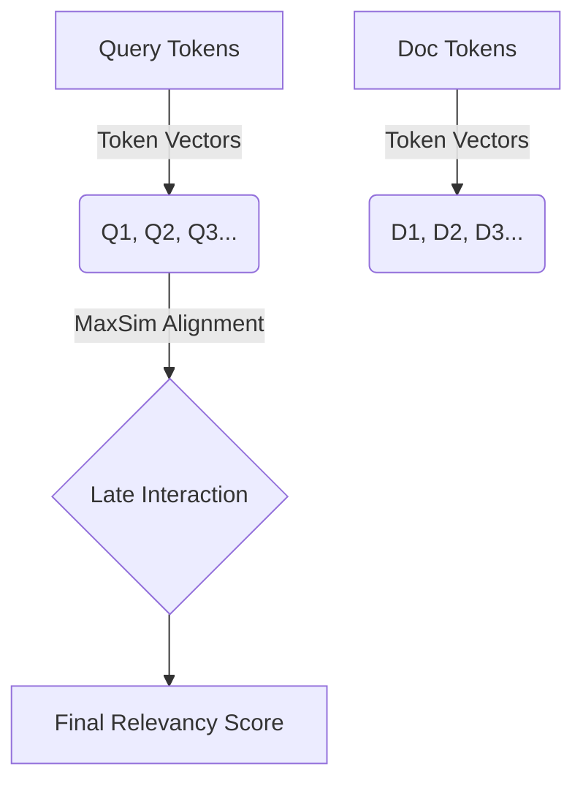

# Lecture 6: Advanced Encoder Architectures

While standard semantic search relies on a "one vector per document" approach, advanced RAG systems often employ more sophisticated encoder architectures to bridge the gap between retrieval speed and precision.

## 1. The Bi-Encoder: The Speed Standard

The **Bi-Encoder** is the vanilla architecture for semantic search. It treats documents and queries as separate entities that are mapped into the same vector space.

- **Mechanism**: Documents are embedded ahead of time into single dense vectors. At query time, only the user prompt is embedded.
- **Comparison**: A similarity metric (like Cosine Similarity) is used to find the closest matches.
- **Advantage**: **Scalability**. Since documents are pre-indexed, searching billions of records is extremely fast.
- **Drawback**: It lacks deep "interaction" between the query and the document text, potentially missing subtle contextual nuances.

## 2. The Cross-Encoder: The Precision Standard

_Source: [Retrieval-Augmented Generation by Zain Hasan - DeepLearning.AI](https://www.deeplearning.ai/courses/retrieval-augmented-generation/)_

A **Cross-Encoder** does not embed text into vectors independently. Instead, it processes the query and document simultaneously.

- **Mechanism**: The query and document are concatenated (e.g., `[Query][SEP][Document]`) and passed together through a transformer model.
- **Output**: The model outputs a single relevancy score (usually 0 to 1).

_Source: [Retrieval-Augmented Generation by Zain Hasan - DeepLearning.AI](https://www.deeplearning.ai/courses/retrieval-augmented-generation/)_

- **Advantage**: **High Real-world Accuracy**. The model identifies complex relationships and contextual alignments between the query and the document.
- **Drawback**: **Terrible Scalability**. You cannot pre-compute scores. Scoring $N$ documents requires $N$ forward passes through the model at query time, making it too slow for initial retrieval in large databases.

## 3. ColBERT: Bridging the Gap (Late Interaction)

_Source: [Retrieval-Augmented Generation by Zain Hasan - DeepLearning.AI](https://www.deeplearning.ai/courses/retrieval-augmented-generation/)_

**ColBERT** (Contextualized Late Interaction over BERT) is a modern architecture designed to provide the precision of a Cross-Encoder with the speed of a Bi-Encoder.

### How it Works:

_Source: [Retrieval-Augmented Generation by Zain Hasan - DeepLearning.AI](https://www.deeplearning.ai/courses/retrieval-augmented-generation/)_

1. **Token Vectors**: Instead of one vector per document, ColBERT generates a vector for **every single token** (word piece) in the text.
2. **Late Interaction**: At query time, each token in the prompt is compared against every token in the document.

_Source: [Retrieval-Augmented Generation by Zain Hasan - DeepLearning.AI](https://www.deeplearning.ai/courses/retrieval-augmented-generation/)_

3. **MaxSim Score**: For each prompt token, the algorithm finds the most similar token in the document. These "maximum similarities" are summed to create the final document score.

- **Pros**: Captures rich, token-level interactions similar to a Cross-Encoder.
- **Cons**: **Storage Overhead**. Storing a vector for every token increases the database size by 10x to 100x compared to a Bi-Encoder.

## 4. Comparison & Decision Framework

| Architecture      | Speed     | Accuracy    | Storage   | Best For                                  |
| :---------------- | :-------- | :---------- | :-------- | :---------------------------------------- |
| **Bi-Encoder**    | Excellent | Good        | Low       | Mass-scale, general purpose search.       |
| **ColBERT**       | Moderate  | Very High   | Very High | Legal, medical, or technical domains.     |
| **Cross-Encoder** | Very Slow | Exceptional | N/A       | **Re-ranking** a small subset of results. |

---

**Key Takeaway**: Selection of an encoder architecture is a trade-off between **latency, cost, and recall**. While Bi-Encoders are the "default" for their efficiency, ColBERT is becoming the go-to for precision-critical applications. Cross-Encoders, though too slow for primary search, serve as the "gold standard" for final result refinement (re-ranking).
